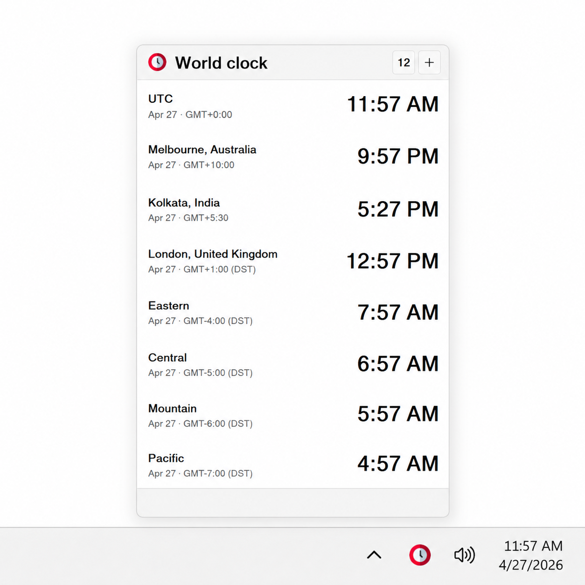

# World Clock



World Clock is a small Windows tray utility for keeping an eye on multiple time zones. It opens from the system tray, shows local times at a glance, and lets you preview a chosen time across all saved locations.

## Highlights

- Small and lightweight: the compiled executable is under 200 KB.
- No installation required: download and run the executable.
- Runs from the Windows system tray.
- Supports run at startup from the tray context menu.
- Shows city and country names, GMT offsets, and daylight saving status.
- Lets you add, remove, and reorder time zones.
- Supports preview time for planning across time zones.
- Supports 12-hour and 24-hour time formats.

## Preview Time

World Clock can temporarily show what the time would be everywhere if one location were set to a specific time. For example, if you are planning a meeting for 9:30 AM in New York, edit the New York row to `9:30` and the other saved cities update to the matching local time.

This is only a preview inside the app. It does not change your Windows system clock. Use **Reset** to return the list to the current live time.

## Download

Download the latest `WorldClock.exe` from the project's [Releases](../../releases) page.

## Installation

No installer is needed.

1. Download `WorldClock.exe` from the [Releases](../../releases) page.
2. Put it anywhere you like, such as a utilities folder.
3. Run `WorldClock.exe`.
4. Optional: enable **Run at startup** from the tray icon context menu.

## Build From Source

Requirements:

- Windows 10 or later
- Visual Studio 2022 Build Tools with the C++ workload
- CMake 3.20 or later
- Ninja

Build:

```powershell
./scripts/build.ps1
```

The compiled app is written to `build/WorldClock.exe`.

## License

World Clock is released under the MIT License. See [LICENSE](LICENSE).

## Attribution

App icon: [Wall clock icons created by Freepik - Flaticon](https://www.flaticon.com/free-icons/wall-clock).